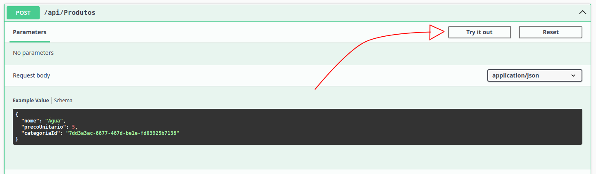
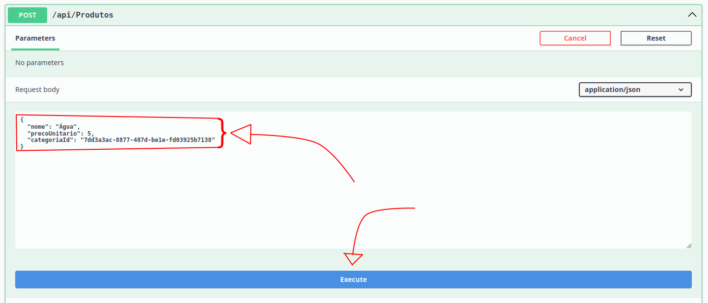
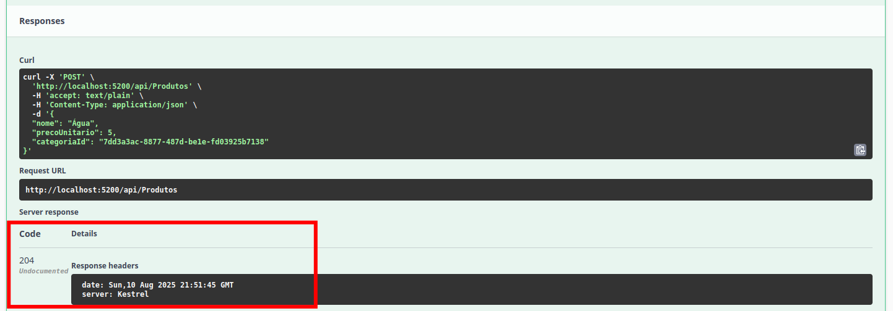

## API de categorias e produtos
RESTful API desenvolvido em .NET 8 para um teste técnico da empresa Devloom, permitindo o cadastro e leitura de categorias e produtos.

## Tecnologias
- .NET 8
- Sqlite
- Dapper
- xUnit
- Swagger

## Decisões tomadas
- Unicidade no nome das categorias, já que não faz sentido haver múltiplas com o mesmo nome.
- Conexão com o Sqlite armazenada estaticamente, pois ele está hospedado em memória e precisa ser compartilhado entre todas as instâncias do seu repositório.
- Validação somente nos ViewModels, porque não há manipulação de dados nos Models.
- ViewModels e Models contém propriedades imutáveis, visto que não é necessário alterá-las após eles serem instanciados.
- FluentValidations foi escolhido em razão dele permitir o retorno automático dos erros de validação, acelerando o processo de desenvolvimento.
- Os endpoints POST retornam erros no mesmo padrão utilizado pelo FluentValidations quando restrições de integridade impedem o cadastro, mantendo a consistência em todos os retornos da API.
- O Dapper foi utilizado por ser um dos requisitos da vaga em questão.

## Como executar
### Pré-requisitos
- .NET 8 SDK instalado na máquina local.

### Passo a passo
Execute os seguintes passos em um terminal de sua preferência:
1. Clone o repositório do Github.
```bash
git clone https://github.com/marvipi-dev/devloom-preliminar
```
2. Entre na pasta da solução.
```bash
cd devloom-preliminar
```

4. Compile e rode o programa.
```bash
dotnet run --project DevloomPreliminar
```

5. Os endpoints agora podem ser acessados pelo Swagger UI ou por programas como o Postman, na URL http://localhost:5200/swagger/index.html.

## Como testar
### Testes unitários
Execute os seguintes passos em um terminal de sua preferência:
1. Clone o repositório do Github.
```bash
git clone https://github.com/marvipi-dev/devloom-preliminar
```
2. Entre na pasta da solução.
```bash
cd devloom-preliminar
```
3. Execute o projeto de teste.
```bash
dotnet test DevloomPreliminar.UnitTest
```

### Swagger
1. Execute o passo a passo para executar o projeto, conforme descrito anteriomente.

2. Acesse o Swagger UI na URL http://localhost:5200/swagger/index.html.

3. Expanda o endpoint que deseja testar no Swagger UI


4. Clique no botão "Try it out" e você verá um botão azul "Execute" e, quando aplicável, os parâmetros e campos requeridos pelo endpoint. Preencham-nos e depois clique em "Execute" para enviar a requisição.


5. Verifique se a resposta está dentro do esperado.

